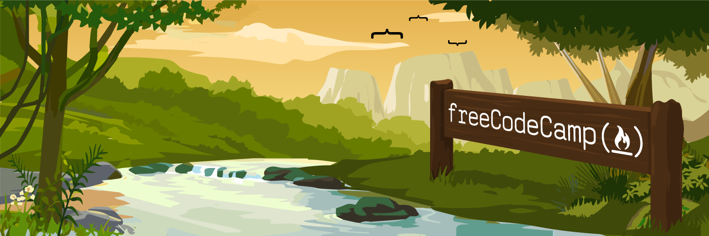

# javaScript-algorithms-and-data-structures

> In this JavaScript Algorithm and Data Structures Certification, you'll learn the JavaScript fundamentals like variables, arrays, objects, loops, functions, the DOM and more.

> You'll also learn about Object Oriented Programming (OOP), Functional Programming, algorithmic thinking, how to work with local storage, and how to fetch data using an API.

 

1. 🔺[Pyramid generator](01-pyramid-generator)
> In this practice project, you'll learn fundamental programming concepts in JavaScript by coding your own Pyramid Generator. You'll learn how to work with arrays, strings, functions, loops, if/else statements, and more.
2. 🎒 [Gradebook app](02-gradebook-app)
> In this mini project, you will get to review JavaScript fundamentals like functions, variables, conditionals and more by building a gradebook app.  
> This will give you an opportunity to solve small problems and get a better understanding of the basics.
3. 🕹️ [Role playing game](03-role-playing-game)
> In this practice project, you'll learn fundamental programming concepts in JavaScript by coding your own Role Playing Game. You'll learn how to work with arrays, strings, objects, functions, loops, if/else statements, and more.
4. 🔵 [Random background](04-random-background)
> In this project, you will help CamperBot build a random background color changer and help them find and fix errors.
5. ⚖️ [Calorie counter](05-calorie-counter)
> In this calorie counter project, you'll learn how to validate user input, perform calculations based on that input, and dynamically update your interface to display the results.  
>In this practice project, you'll learn basic regular expressions, template literals, the addEventListener() method, and more.
6. 👋🏻 [Rock, paper, scissors game](06-rock-paper-scissors/)
>In this mini project, you will review conditionals, functions, getElementById, and more. This project will give you an opportunity to solve small problems and get a better understanding of the basics.
7. 🎵 [Music Player](07-music-player)
>Now let's learn some essential string and array methods like the find(), forEach(), map(), and join(). These methods are crucial for developing dynamic web applications.  
>In this project, you'll code a basic MP3 player using HTML, CSS, and JavaScript. The project covers fundamental concepts such as handling audio playback, managing a playlist, implementing play, pause, next, previous, and shuffle functionalities. You'll even learn how to dynamically update your user interface based on the current song.
8. 🗓️ [Date formatter](08-date-formatter)
>In this project, you'll learn how to work with the JavaScript Date object, including its methods and properties. You'll also learn how to correctly format dates.  
>This project will cover concepts such as the getDate(), getMonth(), and getFullYear() methods.